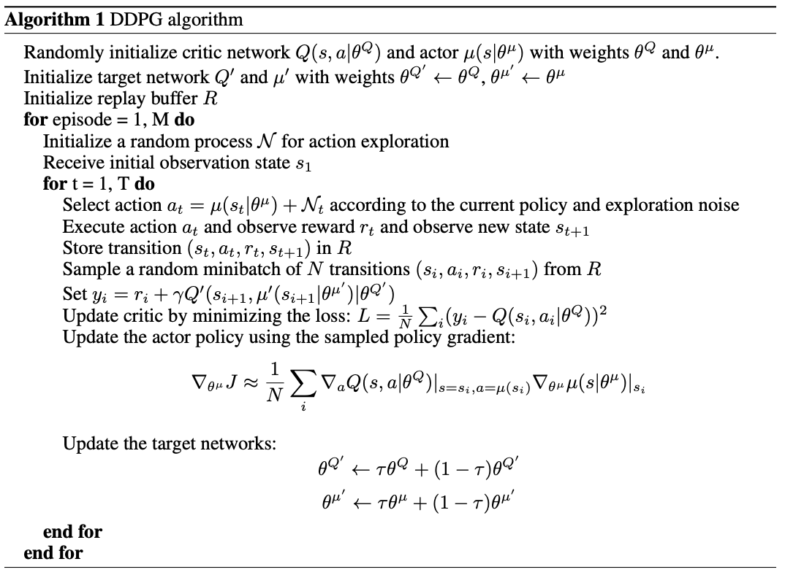
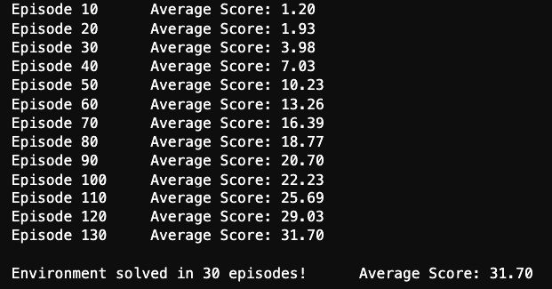
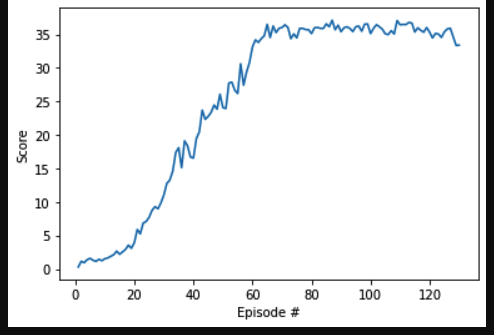

# Report

## Deep Deterministic Policy Gradient

This project implements a DDPG, an Actor-Critic Method as described in following research paper.

[Research Paper](https://arxiv.org/abs/1509.02971)

> In DDPG, authors adapt the ideas of underlying success of Deep Q-Learning to the continous action spaces.
They reuse few techniques from Deep Q-Networks such as Replay Buffer and Soft Updates to the target network.

In DDPG, we use two deep neural networks, one called the *Actor* and the other called the *Critic*.

* Actor:
    The actor here is used to approximate the optimal policy deterministically. That means we want to always output the best
    believed action for any given state. The actor is basically learning the argmax_a Q(s,a) which is the best action.
   
* Critic:
    The critic learns to evaluate the optimal action value function by using the actors best believed action.


In DDPG, you have two copies of network weights for each above network. A Regular Network and Target Network for both actor and critic. The target networks are updated using a soft updates strategy. A soft update strategy consists of slowly blending your
regular network weights with your target network weights.


## Algorithm:



## DDPG Parameters and Training Details:

### Parameters:

```shell

BUFFER_SIZE = int(1e5)  # replay buffer size
BATCH_SIZE = 128        # minibatch size
GAMMA = 0.99            # discount factor
TAU = 1e-3              # for soft update of target parameters
LR_ACTOR = 1e-3         # learning rate of the actor 
LR_CRITIC = 1e-3        # learning rate of the critic
WEIGHT_DECAY = 0        # L2 weight decay

```

### Neural Network:

The project uses following NN architecture:
```
NeuralNet(
  (fc1): Linear(in_features=33, out_features=512, bias=True)
  (fc2): Linear(in_features=512, out_features=512, bias=True)
  (fc3): Linear(in_features=512, out_features=4, bias=True)
)
```

### Result:
The agent achieves the average score of score +30 (over 100 consecutive episodes, and over all agents) using above parameters and architecture. The environment was solved at 59th episode, since the average of the average scores from episodes 59 to 130 (inclusive) was greater than +30.



### Plot of Rewards:




## Ideas for Future Work:
Implement other methods like Trust Region Policy Optimization (TRPO) and Truncated Natural Policy Gradient (TNPG), Proximal Policy Optimization (PPO) and Distributed Distributional Deterministic Policy Gradients (D4PG) to check the performance.

Also tuning the hyper parameters of neural network architecture could help.